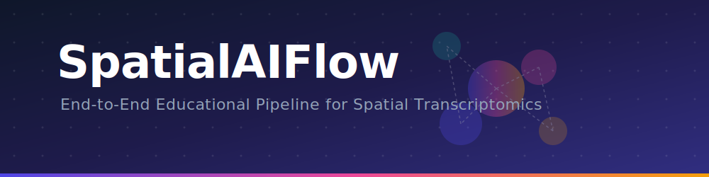
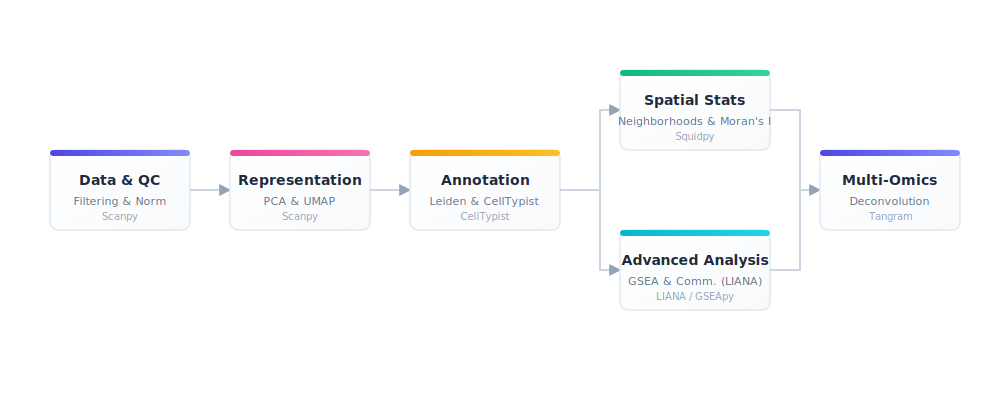
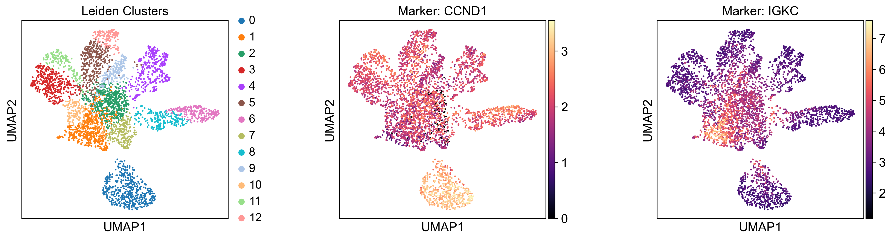
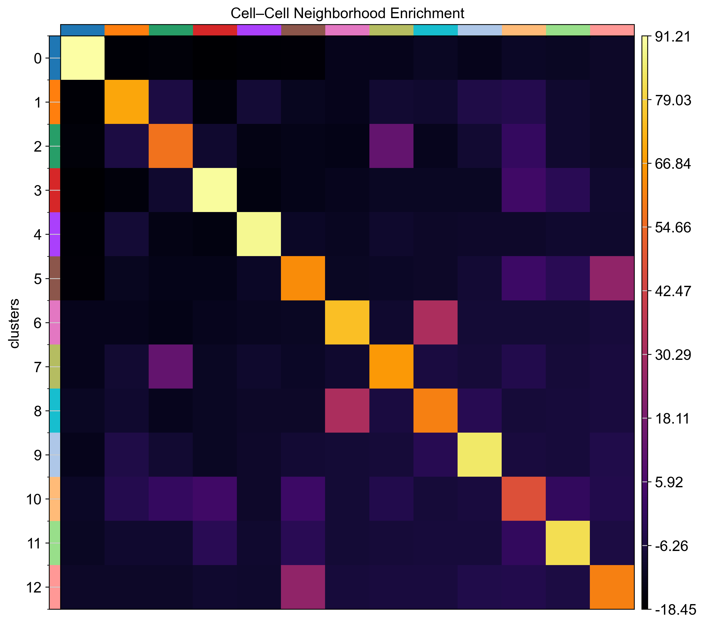

<div align="center">
  
  <br>

  <p><b>An End-to-End Educational Pipeline for Spatial Transcriptomics and Multimodal Fusion</b></p>
  
  [](https://www.python.org/)
  [](https://opensource.org/licenses/MIT)
  [](#documentation)
  [](https://github.com/psf/black)
  [](#)
  [](#)
</div>

---

## 🚀 Overview

**SpatialAIFlow** is a comprehensive, production-ready educational repository designed to bridge the gap between complex spatial transcriptomics data and modern computational analysis. Built for beginners, graduate students, and researchers, this project demonstrates a complete, scientifically rigorous workflow using the state-of-the-art `scverse` ecosystem (Scanpy, Squidpy), seamlessly bridging biology, computer vision, and machine learning.

---

<details open>
<summary><b>📚 Table of Contents</b></summary>

1. [Why SpatialAIFlow?](#-why-spatialaiflow)
2. [Features](#-features)
3. [Biological Workflow](#-biological-workflow)
4. [Repository Structure](#-repository-structure)
5. [Installation](#-installation)
6. [Quick Start](#-quick-start)
7. [Educational Roadmap](#-educational-roadmap)
8. [Example Results](#-example-results)
9. [Technologies Used](#-technologies-used)
10. [Documentation & Citation](#-documentation)
11. [Contributing](#-contributing)
12. [License & Acknowledgements](#-license)

</details>

---

## 💡 Why SpatialAIFlow?

Spatial transcriptomics preserves the geographical organization of cells within a tissue, unlocking unprecedented insights into cell-cell communication, tumor microenvironments, and tissue architecture. However, analyzing these datasets requires domain knowledge spanning **Bioinformatics**, **Machine Learning**, and **Computer Vision**. 

SpatialAIFlow acts as a living textbook. Rather than just offering a black-box script, every analytical step in our Jupyter Notebook contains detailed interpretations of *why* we perform a step, *how* the algorithms work, and *what* the output means biologically.

---

## ✨ Features

| Feature | Description |
|:---|:---|
| 🧬 **End-to-End Pipeline** | Raw data processing, QC, clustering, annotation, and spatial statistics. |
| 🤖 **Machine Learning Fusion** | Automated annotation using `CellTypist` and Random Forest classifiers. |
| 🔬 **Multi-Omics Integration** | Map scRNA-seq to spatial coordinates using `Tangram`. |
| 📡 **Cell Communication** | Discover spatially constrained ligand-receptor interactions using `LIANA`. |
| 🎓 **Educational First** | Over 20 structured learning chapters with explicit learning objectives. |
| 📈 **Publication Ready** | Generates high-quality SVG/PNG plots for spatial maps, UMAPs, and pathways. |

---

## 🗺️ Biological Workflow

The pipeline orchestrates multiple computational layers. Below is the high-level architecture of the analytical flow:

<div align="center">
  
</div>

---

## 📂 Repository Structure

The project is structured according to best practices for reproducible computational research.

```text
SpatialAIFlow/
├── assets/                  # Graphical assets for documentation
│   ├── banner/              # Project banners
│   ├── figures/             # Exported PNG/SVG figures from the pipeline
│   ├── icons/               # README icons
│   ├── logos/               # Project logos
│   └── workflow/            # Pipeline diagrams
├── data/                    # (Ignored) Directory for raw/processed AnnData
├── docs/                    # MkDocs/Sphinx documentation source
├── notebooks/               # The core Jupyter notebooks
│   └── SpatialAIFlow.ipynb  # The primary educational notebook
├── outputs/                 # Exported models and data products
├── scripts/                 # Utility scripts (generation, extraction)
├── src/                     # Python package source (for reusable modules)
│   └── spatialaiflow/       
└── environment.yml          # Conda environment definition
```

---

## 🚀 Installation

You can install and run SpatialAIFlow using either `conda` or standard Python `venv`. We strongly recommend `conda` due to the heavy scientific dependencies.

### Conda (Recommended)

```bash
# Clone the repository
git clone https://github.com/username/SpatialAIFlow.git
cd SpatialAIFlow

# Create the environment
conda env create -f environment.yml

# Activate the environment
conda activate spatialaiflow
```

### pip

```bash
python -m venv .venv
source .venv/bin/activate  # On Windows: .\.venv\Scripts\Activate.ps1
pip install -r requirements.txt
pip install -e ".[all]"    # Install optional dependencies
```

### Docker *(Coming Soon)*

```bash
# docker pull spatialaiflow/spatialaiflow:latest
```

---

## ⚡ Quick Start

To begin the interactive learning experience, launch Jupyter Lab:

```bash
jupyter lab
```

Navigate to `notebooks/SpatialAIFlow.ipynb` and run the cells interactively. The notebook is fully self-contained and will automatically download a sample Visium dataset (V1_Breast_Cancer_Block_A_Section_1) if local data is not found.

---

## 🎓 Educational Roadmap

The notebook `SpatialAIFlow.ipynb` is divided into 24 pedagogical chapters. Here is a brief overview:

1. **Environment Setup**: Validating the scverse ecosystem.
2. **Data Loading**: Ingesting Visium H&E images and count matrices.
3. **Quality Control (QC)**: Filtering low-quality spots and mitochondrial reads.
4. **Data Normalization**: Log-transformation and highly variable gene (HVG) selection.
5. **Dimensionality Reduction**: PCA computation and variance explained.
6. **Neighborhood Graphs**: Building the spatial KNN graph.
7. **UMAP Visualization**: Non-linear projection of the transcriptomic manifold.
8. **Leiden Clustering**: Unsupervised grouping of distinct cell populations.
9. **Marker Gene Identification**: Statistical ranking of cluster-specific genes.
10. **Spatial Gene Expression**: Mapping molecular signatures back to tissue coordinates.
11. **Spatial Autocorrelation (Moran's I)**: Finding genes with non-random spatial patterns.
12. **Cell-Cell Neighborhood Enrichment**: Understanding which cell types colocalize.
13. **Ligand-Receptor Co-occurrence**: Testing for localized molecular interactions.
14. **Manual Cell Type Annotation**: Using biological priors to label clusters.
15. **Cell-Cell Communication**: LIANA-driven interactome mapping.
16. **Tissue Modules (NMF)**: Factorizing the data into spatial expression programs.
17. **Computer Vision Features**: Extracting texture and color from the H&E image.
18. **Pathway Enrichment (GSEA)**: Identifying active biological pathways.
19. **Automated Annotation (CellTypist)**: Using pre-trained immune/cancer models.
20. **Tumor Microenvironment (TME)**: Defining the invasive margin.
21. **Cellular Trajectories (PAGA)**: Inferring continuous phenotypic transitions.
22. **Spatial Niche Analysis**: Discovering robust multicellular microenvironments.
23. **Machine Learning Predictors**: Using Random Forests to predict spatial niches.
24. **Multi-Omics Fusion (Tangram)**: Mapping single-cell references onto spatial spots.

---

## 📊 Example Results

Below are highlights of the outputs generated natively by the pipeline. High-resolution versions can be found in `assets/figures/`.

### 1. Spatial Gene Expression
Mapping individual marker genes (e.g., *ERBB2*, *CD3E*) directly onto the H&E tissue slice.
<div align="center">
  
</div>

### 2. Leiden Clustering & UMAP
Unsupervised clustering groups spots with similar transcriptomic profiles, which often corresponds to distinct morphological regions (e.g., tumor vs. stroma).
<div align="center">
  
</div>

### 3. Neighborhood Enrichment
A statistical heatmap showing which annotated cell types are significantly co-located or repelled in physical space.
<div align="center">
  
</div>

### 4. Cell-Cell Communication (LIANA)
Ligand-receptor interaction strengths between defined cellular niches, highlighting potential tumor-immune crosstalk.
<div align="center">
  
</div>

---

## 🛠️ Technologies Used

SpatialAIFlow is proudly built upon the modern open-source scientific Python ecosystem:

- **[Scanpy](https://scanpy.readthedocs.io/)**: Single-cell analysis.
- **[Squidpy](https://squidpy.readthedocs.io/)**: Spatial omics and image analysis.
- **[AnnData](https://anndata.readthedocs.io/)**: Annotated data structures.
- **[CellTypist](https://www.celltypist.org/)**: Automated cell type annotation.
- **[LIANA](https://liana-py.readthedocs.io/)**: Ligand-receptor inference.
- **[Tangram](https://github.com/broadinstitute/Tangram)**: Multi-omics spatial mapping.
- **[GSEApy](https://gseapy.readthedocs.io/)**: Pathway enrichment.
- **[Scikit-Learn](https://scikit-learn.org/)**: Machine learning classifiers.

---

## 📖 Interactive Documentation

> 🚀 **Read the complete SpatialAIFlow tutorial online**

- 🌐 **NBViewer:** https://nbviewer.org/github/Abdullah-I-Ali/SpatialAIFlow/blob/main/notebooks/SpatialAIFlow.ipynb
- 🚀 **Open in Google Colab:** https://colab.research.google.com/github/Abdullah-I-Ali/SpatialAIFlow/blob/main/notebooks/SpatialAIFlow.ipynb
- 💻 **Browse on GitHub:** `notebooks/SpatialAIFlow.ipynb` as the official documentation, tutorial, and educational guide for the project.

It covers:

- Biological Background
- Computational Background
- Step-by-step Pipeline
- Python Implementation
- Biological Interpretation
- Common Mistakes
- Exercises
- Further Reading

## 🚀 Start Learning

➡️ **notebooks/SpatialAIFlow.ipynb**

## 🖋️ Citation

If you use SpatialAIFlow in your teaching or research, please cite:

```bibtex
@software{SpatialAIFlow2026,
  author = {Abdullah I Ali},
  title = {SpatialAIFlow: An End-to-End Educational Pipeline for Spatial Transcriptomics},
  year = {2026},
  url = {https://github.com/username/SpatialAIFlow}
}
```
See the `CITATION.cff` file for more details.

## 🤝 Contributing

We welcome contributions! Please see our [Contributing Guidelines](CONTRIBUTING.md) for details on how to submit pull requests, report issues, and improve the educational content.

## ⚖️ License

This project is licensed under the [MIT License](LICENSE).

## 🙏 Acknowledgements

We thank the developers of the `scverse` ecosystem and the authors of the 10x Genomics Visium datasets used in these tutorials.
